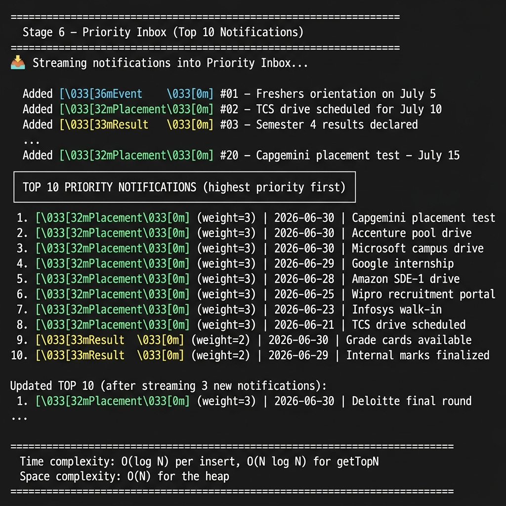

# Stage 1

## REST API Design for the Notification Platform

### Overview

This document describes the REST API contract for a notification platform that serves logged-in students. It covers the core actions, endpoint design, JSON schemas, and a real-time notification mechanism.

---

### Core Actions

The notification platform must support:

| Action | Description |
|---|---|
| **Fetch notifications** | Retrieve all (or paginated) notifications for the logged-in student |
| **Fetch unread count** | Get the count of unread notifications |
| **Mark as read** | Mark a single notification as read |
| **Mark all as read** | Mark all notifications for a student as read |
| **Delete a notification** | Remove a specific notification |
| **Create a notification** | (Internal / Admin API) Push a notification to one or more students |
| **Real-time subscribe** | Establish a real-time channel to receive live notifications |

---

### Authentication & Common Headers

All endpoints are **protected routes** — a valid JWT token is required.

**Request Headers (common to all endpoints):**

```
Authorization: Bearer <jwt_token>
Content-Type:  application/json
Accept:        application/json
X-Request-ID:  <uuid>         (optional, for tracing)
```

**Response Headers (common to all endpoints):**

```
Content-Type:   application/json
X-Request-ID:   <uuid>
X-RateLimit-Limit:     100
X-RateLimit-Remaining: 97
```

---

### Endpoint Definitions

---

#### 1. GET `/api/v1/notifications`

Fetch paginated notifications for the authenticated student.

**Query Parameters:**

| Parameter | Type | Required | Default | Description |
|---|---|---|---|---|
| `page` | integer | No | 1 | Page number |
| `limit` | integer | No | 20 | Results per page (max 100) |
| `isRead` | boolean | No | — | Filter by read status |
| `type` | string | No | — | Filter by `Event`, `Result`, `Placement` |

**Request:**
```
GET /api/v1/notifications?page=1&limit=20&isRead=false
Authorization: Bearer <token>
```

**Response — 200 OK:**
```json
{
  "success": true,
  "data": {
    "notifications": [
      {
        "id": "notif_001",
        "studentId": "stu_1042",
        "notificationType": "Placement",
        "title": "TCS Drive Scheduled",
        "message": "TCS campus drive is scheduled for July 10, 2026.",
        "isRead": false,
        "createdAt": "2026-06-28T10:30:00Z",
        "updatedAt": "2026-06-28T10:30:00Z"
      }
    ],
    "pagination": {
      "currentPage": 1,
      "totalPages": 5,
      "totalCount": 87,
      "limit": 20,
      "hasNextPage": true,
      "hasPreviousPage": false
    }
  }
}
```

**Response — 401 Unauthorized:**
```json
{
  "success": false,
  "error": {
    "code": "UNAUTHORIZED",
    "message": "Invalid or expired token."
  }
}
```

---

#### 2. GET `/api/v1/notifications/unread-count`

Get the unread notification count for the authenticated student.

**Request:**
```
GET /api/v1/notifications/unread-count
Authorization: Bearer <token>
```

**Response — 200 OK:**
```json
{
  "success": true,
  "data": {
    "unreadCount": 14
  }
}
```

---

#### 3. GET `/api/v1/notifications/:id`

Fetch a single notification by ID.

**Request:**
```
GET /api/v1/notifications/notif_001
Authorization: Bearer <token>
```

**Response — 200 OK:**
```json
{
  "success": true,
  "data": {
    "notification": {
      "id": "notif_001",
      "studentId": "stu_1042",
      "notificationType": "Placement",
      "title": "TCS Drive Scheduled",
      "message": "TCS campus drive is scheduled for July 10, 2026.",
      "isRead": false,
      "createdAt": "2026-06-28T10:30:00Z",
      "updatedAt": "2026-06-28T10:30:00Z"
    }
  }
}
```

**Response — 404 Not Found:**
```json
{
  "success": false,
  "error": {
    "code": "NOT_FOUND",
    "message": "Notification not found."
  }
}
```

---

#### 4. PATCH `/api/v1/notifications/:id/read`

Mark a single notification as read.

**Request:**
```
PATCH /api/v1/notifications/notif_001/read
Authorization: Bearer <token>
```

**Request Body:** *(none required)*

**Response — 200 OK:**
```json
{
  "success": true,
  "data": {
    "id": "notif_001",
    "isRead": true,
    "updatedAt": "2026-06-29T08:00:00Z"
  }
}
```

---

#### 5. PATCH `/api/v1/notifications/mark-all-read`

Mark all notifications for the authenticated student as read.

**Request:**
```
PATCH /api/v1/notifications/mark-all-read
Authorization: Bearer <token>
```

**Response — 200 OK:**
```json
{
  "success": true,
  "data": {
    "updatedCount": 14,
    "message": "All notifications marked as read."
  }
}
```

---

#### 6. DELETE `/api/v1/notifications/:id`

Delete a specific notification.

**Request:**
```
DELETE /api/v1/notifications/notif_001
Authorization: Bearer <token>
```

**Response — 200 OK:**
```json
{
  "success": true,
  "data": {
    "message": "Notification deleted successfully."
  }
}
```

---

#### 7. POST `/api/v1/admin/notifications` *(Internal / Admin only)*

Create and push a notification to one or more students. Requires an admin-level JWT.

**Request:**
```
POST /api/v1/admin/notifications
Authorization: Bearer <admin_token>
Content-Type:  application/json
```

**Request Body:**
```json
{
  "studentIds": ["stu_1042", "stu_1043"],
  "notificationType": "Placement",
  "title": "Infosys Drive",
  "message": "Infosys walk-in drive on July 12. Register before July 10."
}
```

**Field Constraints:**

| Field | Type | Required | Values |
|---|---|---|---|
| `studentIds` | string[] | Yes | Array of student IDs |
| `notificationType` | enum | Yes | `Event`, `Result`, `Placement` |
| `title` | string | Yes | Max 150 chars |
| `message` | string | Yes | Max 1000 chars |

**Response — 201 Created:**
```json
{
  "success": true,
  "data": {
    "notificationsCreated": 2,
    "notificationIds": ["notif_101", "notif_102"]
  }
}
```

---

### Notification JSON Schema

```json
{
  "id":               "string  — unique notification ID (UUID)",
  "studentId":        "string  — ID of the recipient student",
  "notificationType": "enum    — 'Event' | 'Result' | 'Placement'",
  "title":            "string  — short headline (max 150 chars)",
  "message":          "string  — full notification body (max 1000 chars)",
  "isRead":           "boolean — false by default",
  "createdAt":        "string  — ISO 8601 UTC timestamp",
  "updatedAt":        "string  — ISO 8601 UTC timestamp"
}
```

---

### Real-Time Notification Mechanism: Server-Sent Events (SSE)

**Chosen mechanism: Server-Sent Events (SSE)**

SSE is chosen over WebSockets because:
- Notifications are **server → client** only (no need for bidirectional communication)
- SSE works over standard HTTP, does not require upgrading the connection
- Automatic browser reconnection with `EventSource`
- Simpler infrastructure — no separate WebSocket server needed
- Compatible with HTTP/2 multiplexing

#### SSE Endpoint

```
GET /api/v1/notifications/stream
Authorization: Bearer <token>   (sent as query param or custom header, since EventSource doesn't support custom headers natively)
```

**Example query-param auth:**
```
GET /api/v1/notifications/stream?token=<jwt>
```

**Response Headers:**
```
Content-Type:   text/event-stream
Cache-Control:  no-cache
Connection:     keep-alive
```

**SSE Event Format (server pushes):**
```
event: new_notification
data: {"id":"notif_105","notificationType":"Placement","title":"Amazon Drive","message":"Amazon SDE-1 drive on July 20.","isRead":false,"createdAt":"2026-06-30T12:00:00Z"}

event: ping
data: {}
```

**Client-side example (browser):**
```javascript
const es = new EventSource('/api/v1/notifications/stream?token=' + jwt);

es.addEventListener('new_notification', (event) => {
  const notification = JSON.parse(event.data);
  displayNotification(notification);
});

es.onerror = () => {
  // EventSource auto-reconnects
};
```

---

---

# Stage 2

## Persistent Storage: Database Choice, Schema, Scaling & Queries

### Recommended Database: PostgreSQL

**Why PostgreSQL?**

The notification data is highly structured (fixed fields, known types via enum), relational (tied to students), and requires ACID-compliant transactions (e.g., "mark all as read" must be atomic). PostgreSQL is the ideal choice because:

| Criteria | PostgreSQL |
|---|---|
| ACID compliance | ✅ Full |
| Structured schema | ✅ Enforced via DDL |
| Enum support | ✅ Native `CREATE TYPE` |
| Indexing | ✅ B-tree, partial, composite |
| JSON support | ✅ `jsonb` for metadata |
| Scaling | ✅ Read replicas, partitioning |
| Mature ecosystem | ✅ Widely supported |

---

### Database Schema

```sql
-- Enum for notification types
CREATE TYPE notification_type AS ENUM ('Event', 'Result', 'Placement');

-- Students table (reference)
CREATE TABLE students (
    id          SERIAL PRIMARY KEY,
    name        VARCHAR(200)        NOT NULL,
    email       VARCHAR(255) UNIQUE NOT NULL,
    created_at  TIMESTAMPTZ         NOT NULL DEFAULT NOW()
);

-- Notifications table
CREATE TABLE notifications (
    id                  UUID            PRIMARY KEY DEFAULT gen_random_uuid(),
    student_id          INTEGER         NOT NULL REFERENCES students(id) ON DELETE CASCADE,
    notification_type   notification_type NOT NULL,
    title               VARCHAR(150)    NOT NULL,
    message             TEXT            NOT NULL,
    is_read             BOOLEAN         NOT NULL DEFAULT FALSE,
    created_at          TIMESTAMPTZ     NOT NULL DEFAULT NOW(),
    updated_at          TIMESTAMPTZ     NOT NULL DEFAULT NOW()
);

-- Index for the most common query pattern: unread notifications per student
CREATE INDEX idx_notifications_student_unread
    ON notifications (student_id, is_read, created_at DESC)
    WHERE is_read = FALSE;

-- Index for type-based filtering
CREATE INDEX idx_notifications_type_created
    ON notifications (notification_type, created_at DESC);

-- Trigger to auto-update updated_at
CREATE OR REPLACE FUNCTION update_updated_at()
RETURNS TRIGGER AS $$
BEGIN
  NEW.updated_at = NOW();
  RETURN NEW;
END;
$$ LANGUAGE plpgsql;

CREATE TRIGGER trg_notifications_updated_at
  BEFORE UPDATE ON notifications
  FOR EACH ROW EXECUTE FUNCTION update_updated_at();
```

---

### Problems at Scale (50,000 students, 5,000,000 notifications)

| Problem | Description |
|---|---|
| **Sequential scans** | Without proper indexes, `WHERE student_id = X AND is_read = false` requires a full table scan |
| **Lock contention** | Mass `UPDATE` (mark all read) on millions of rows causes table-level locks |
| **Write amplification** | Each notification creation updates the table + all indexes |
| **Storage bloat** | MVCC in PostgreSQL leaves dead tuples; requires regular `VACUUM` |
| **Connection exhaustion** | 50k students hitting the DB simultaneously can exhaust connection pools |
| **Pagination at deep offsets** | `OFFSET 10000 LIMIT 20` is slow; it reads 10,020 rows to return 20 |

---

### Solutions

1. **Table Partitioning** — Partition `notifications` by `created_at` (monthly ranges) to reduce scan size.
2. **Read Replicas** — Route all `SELECT` queries to read replicas; writes go to primary.
3. **Connection Pooling** — Use PgBouncer to pool connections and prevent exhaustion.
4. **Caching** — Cache unread counts per student in Redis with a TTL (see Stage 4).
5. **Cursor-based Pagination** — Replace `OFFSET` with `WHERE created_at < :cursor` for deep pages.
6. **Archival** — Move notifications older than 6 months to a cold store (e.g., S3 + Parquet).

---

### SQL Queries Based on the API (Stage 1)

```sql
-- 1. Fetch paginated notifications for a student (cursor-based)
SELECT id, notification_type, title, message, is_read, created_at
FROM notifications
WHERE student_id = 1042
  AND created_at < '2026-06-29T00:00:00Z'   -- cursor from last item
ORDER BY created_at DESC
LIMIT 20;

-- 2. Fetch unread notifications for a student
SELECT id, notification_type, title, message, created_at
FROM notifications
WHERE student_id = 1042
  AND is_read = FALSE
ORDER BY created_at DESC
LIMIT 20;

-- 3. Get unread count for a student
SELECT COUNT(*) AS unread_count
FROM notifications
WHERE student_id = 1042
  AND is_read = FALSE;

-- 4. Mark a single notification as read
UPDATE notifications
SET is_read = TRUE
WHERE id = 'notif-uuid-here'
  AND student_id = 1042;   -- ownership check

-- 5. Mark all notifications as read for a student
UPDATE notifications
SET is_read = TRUE
WHERE student_id = 1042
  AND is_read = FALSE;

-- 6. Delete a notification
DELETE FROM notifications
WHERE id = 'notif-uuid-here'
  AND student_id = 1042;

-- 7. Create a notification (insert)
INSERT INTO notifications (student_id, notification_type, title, message)
VALUES (1042, 'Placement', 'TCS Drive', 'TCS campus drive on July 10.')
RETURNING id, created_at;
```

---

---

# Stage 3

## Query Analysis, Optimization & Indexing Strategy

### The Original Query

```sql
SELECT * FROM notifications
WHERE studentID = 1042 AND isRead = false
ORDER BY createdAt ASC;
```

### Is the Query Accurate?

The query is **logically correct** — it fetches all unread notifications for student 1042, sorted oldest-first. However:
- Using `SELECT *` fetches all columns including `message` (TEXT), which is unnecessary if only metadata is displayed in a list view. Prefer selecting only required columns.
- The column names (`studentID`, `isRead`, `createdAt`) should match the actual DDL. In our schema these are `student_id`, `is_read`, `created_at` (snake_case convention). Assuming the table uses camelCase column names as written.

### Why Is It Slow?

At 5,000,000 notifications with no relevant index:

1. **Full table scan** — PostgreSQL reads all 5M rows to find matching `studentID = 1042 AND isRead = false`.
2. **In-memory sort** — After filtering, PostgreSQL must sort the matching rows by `createdAt ASC`. With many unread notifications, this is done on a large result set.
3. **High I/O** — All pages of the notifications table are read from disk.

**Estimated cost (no index):**
- Seq Scan: ~5M rows read → hundreds of milliseconds to seconds on spinning disk
- Sort on filtered result set (e.g., 500 rows): negligible after filter, but filter itself is the bottleneck

### What Would I Change?

**Step 1 — Add a composite index:**
```sql
CREATE INDEX idx_notifications_student_unread
ON notifications (studentID, isRead, createdAt ASC)
WHERE isRead = false;
```

This is a **partial composite index**. It:
- Covers the `WHERE studentID = ? AND isRead = false` filter exactly
- Pre-sorts by `createdAt ASC` so no external sort is needed
- The `WHERE isRead = false` partial predicate means the index only contains unread rows → smaller, faster

**Optimized query:**
```sql
SELECT id, notification_type, title, message, createdAt
FROM notifications
WHERE studentID = 1042 AND isRead = false
ORDER BY createdAt ASC;
```

**Likely computation cost after optimization:**
- Index scan on `idx_notifications_student_unread` → reads only the specific student's unread entries (e.g., 50–200 rows)
- No sort needed (index already ordered)
- Cost: **O(log N + K)** where K is the number of unread notifications for the student — effectively sub-millisecond

---

### Should You Add Indexes on Every Column?

**No. This is bad advice. Here's why:**

| Concern | Explanation |
|---|---|
| **Write overhead** | Every `INSERT`, `UPDATE`, and `DELETE` must update ALL indexes. With 50,000 students receiving notifications simultaneously, excessive indexes cause severe write slowdown. |
| **Storage cost** | Each index consumes disk space proportional to the table size. Indexing every column can double or triple storage requirements. |
| **Query planner confusion** | The PostgreSQL query planner evaluates all available indexes; too many can lead to suboptimal plan choices. |
| **Cache pollution** | Indexes compete for shared buffer cache space. Unused indexes evict useful data. |

**Best practice:** Index only the columns that appear in `WHERE`, `ORDER BY`, or `JOIN` clauses of your most frequent, slow queries. Profile first with `EXPLAIN ANALYZE`, then add targeted indexes.

---

### Query: Students Who Got a Placement Notification in the Last 7 Days

```sql
SELECT DISTINCT s.id, s.name, s.email
FROM students s
JOIN notifications n ON n.student_id = s.id
WHERE n.notification_type = 'Placement'
  AND n.created_at >= NOW() - INTERVAL '7 days';
```

**Supporting index:**
```sql
CREATE INDEX idx_notifications_type_created
ON notifications (notification_type, created_at DESC);
```

This index efficiently supports the `WHERE notification_type = 'Placement' AND created_at >= ...` filter.

---

---

# Stage 4

## Caching Strategy: Solving DB Overload on Every Page Load

### The Problem

- Notifications are fetched on **every page load** for every student.
- With 50,000 concurrent students, this generates 50,000 DB queries per second at peak.
- The database becomes the bottleneck, causing slow responses and poor UX.

---

### Proposed Solutions & Tradeoffs

---

#### Strategy 1: Redis Cache for Notification Data

**How it works:**
- On first request, fetch from DB and store result in Redis with a TTL (e.g., 30 seconds for unread count, 60 seconds for notification list).
- Subsequent requests are served from Redis, not the DB.
- On write events (new notification, mark as read), **invalidate** the relevant cache key.

**Cache keys:**
```
notifications:{studentId}:list:{page}:{filters}   TTL: 60s
notifications:{studentId}:unread_count             TTL: 30s
```

**Pseudocode:**
```
function getNotifications(studentId, page):
  key = "notifications:" + studentId + ":list:" + page
  cached = redis.get(key)
  if cached:
    return JSON.parse(cached)
  result = db.query("SELECT ... FROM notifications WHERE student_id = ? ...", studentId)
  redis.setex(key, 60, JSON.stringify(result))
  return result
```

**Tradeoffs:**

| Pro | Con |
|---|---|
| Dramatically reduces DB load | Stale data possible up to TTL window |
| Sub-millisecond response from Redis | Cache invalidation logic adds complexity |
| Scales independently from DB | Memory cost for Redis |

---

#### Strategy 2: HTTP Response Caching with ETags / Last-Modified

**How it works:**
- Server returns `ETag` or `Last-Modified` headers.
- Client caches the response; on next request, sends `If-None-Match` or `If-Modified-Since`.
- If data hasn't changed, server returns **304 Not Modified** (no body), saving bandwidth.

**Tradeoffs:**

| Pro | Con |
|---|---|
| Zero server-side infrastructure changes | Still hits the server on every request |
| Saves bandwidth | Doesn't reduce DB queries if server always checks DB |
| Native browser support | Benefit is mainly for static-ish data |

---

#### Strategy 3: Push-based Model (SSE / WebSocket) — Replace Polling

**How it works:**
- Instead of fetching on every page load, the client subscribes once via SSE.
- The server pushes new notifications in real time.
- The client maintains a local in-memory/localStorage store of notifications.

**Tradeoffs:**

| Pro | Con |
|---|---|
| Eliminates per-page-load DB queries entirely | Requires stateful SSE connections (memory on server) |
| Instant notification delivery | Harder to scale horizontally (use Redis Pub/Sub to fan out) |
| Best UX | Complex reconnection logic needed |

---

#### Strategy 4: Read Replicas + Connection Pooling

**How it works:**
- Direct all read queries to PostgreSQL **read replicas**.
- Use **PgBouncer** to pool connections (prevents connection exhaustion at 50k students).

**Tradeoffs:**

| Pro | Con |
|---|---|
| No application code changes | Replication lag (replica may be slightly behind primary) |
| Linear horizontal scaling | Infrastructure cost for replicas |
| Reduces primary DB load | Doesn't help if queries are themselves slow |

---

### Recommended Combined Strategy

1. **Redis cache** for notification lists and unread counts (primary DB relief).
2. **SSE** for real-time push (eliminate polling entirely).
3. **Read replicas** for cache-miss fallback DB queries.
4. **PgBouncer** for connection pooling.

This combination virtually eliminates per-page-load DB queries while ensuring near-real-time notification delivery.

---

---

# Stage 5

## Bulk Notification System: Reliability & Redesign

### The Original Implementation (Pseudocode)

```python
function notify_all(student_ids: array, message: string):
    for student_id in student_ids:
        send_email(student_id, message)   # calls Email API
        save_to_db(student_id, message)   # DB insert
        push_to_app(student_id, message)  # SSE push
```

---

### Shortcomings Observed

1. **Sequential processing** — Notifying 50,000 students one-by-one synchronously will take minutes/hours. This blocks the HR's request and times out.
2. **No error handling** — If `send_email` fails for student #201, the loop crashes; students #202–#50,000 never get notified.
3. **Partial failures are silent** — There is no record of which students failed; manual recovery is impossible.
4. **Tight coupling** — Email, DB insert, and in-app push are all in the same synchronous call. One failure cascades to others.
5. **No retry logic** — Transient email API failures are treated as permanent.
6. **DB overload** — 50,000 individual `INSERT` statements fire in rapid succession without batching.

---

### The Failure Scenario

> `send_email` failed for 200 students midway.

With the original code: 
- The loop crashes at student #200 (or 200 random failures scattered throughout).
- No emails or in-app notifications are sent to students #201–#50,000.
- The DB may have partial inserts (some students have DB records but no email was sent).
- There is no way to identify which 200 students failed or retry just them.

---

### Should DB save and email happen together?

**No — they should be decoupled.**

- The DB insert is the **source of truth** for the notification. It should succeed regardless of whether the email delivery succeeds.
- Email delivery is best-effort and can be retried asynchronously.
- If they are coupled in a single transaction: an email API timeout will roll back the DB insert, meaning the notification is lost entirely.

**Rule:** Persist first, deliver asynchronously.

---

### Redesigned Architecture: Message Queue + Worker Pool

**Key principles:**
1. **Enqueue, don't execute** — HR's request enqueues 50,000 jobs into a message queue (e.g., RabbitMQ, AWS SQS, Redis Streams) immediately and returns a 202 Accepted response.
2. **Workers process independently** — Worker processes dequeue jobs and handle each student independently. Failures in one job don't affect others.
3. **Batched DB inserts** — Workers insert in batches of 100–500 rows at a time, not one-by-one.
4. **Retry with exponential backoff** — Failed jobs are re-queued with a delay (1s → 2s → 4s → dead-letter queue after 3 attempts).
5. **Dead Letter Queue (DLQ)** — Permanently failed jobs land in a DLQ for manual inspection/replay.
6. **Idempotency** — Each job has a unique key (`student_id + notification_id`) so retries don't create duplicate notifications.

---

### Revised Pseudocode

```python
# ── HR triggers "Notify All" ──────────────────────────────────────────────────
function notify_all(student_ids: array, message: string):
    notification_batch_id = generate_uuid()
    
    # Save the notification template once
    template = db.insert("notification_batches", {
        id: notification_batch_id,
        message: message,
        total: len(student_ids),
        sent: 0,
        failed: 0,
        status: "pending",
        created_at: now()
    })
    
    # Enqueue one job per student (or chunk into batches of 500)
    chunks = chunk(student_ids, 500)
    for chunk in chunks:
        queue.enqueue("send_notification_chunk", {
            batch_id: notification_batch_id,
            student_ids: chunk,
            message: message
        })
    
    return { status: "accepted", batch_id: notification_batch_id }
    # Returns 202 immediately — HR is not blocked


# ── Worker: processes one chunk ───────────────────────────────────────────────
function process_notification_chunk(job):
    batch_id   = job.batch_id
    student_ids = job.student_ids
    message    = job.message
    
    # 1. Batch insert into DB (atomic for this chunk)
    notifications = []
    for student_id in student_ids:
        notifications.append({
            id: generate_uuid(),
            student_id: student_id,
            message: message,
            batch_id: batch_id,
            is_read: false,
            created_at: now()
        })
    
    db.bulk_insert("notifications", notifications)  # single INSERT with 500 rows
    
    # 2. Send emails — independently, with retry
    for student_id in student_ids:
        enqueue_with_retry("send_email_job", {
            student_id: student_id,
            message: message,
            idempotency_key: batch_id + ":" + student_id
        }, max_retries=3, backoff="exponential")
    
    # 3. Push SSE event to connected clients
    for student_id in student_ids:
        sse_broker.publish(channel="student:" + student_id, event="new_notification", data=message)
    
    # 4. Update batch progress
    db.increment("notification_batches", { id: batch_id }, { sent: len(student_ids) })


# ── Email worker (separate queue) ─────────────────────────────────────────────
function send_email_job(job):
    try:
        email_api.send(student_id=job.student_id, message=job.message)
    except TransientError:
        raise RetryableError()   # queue retries with backoff
    except PermanentError:
        dead_letter_queue.push(job)   # log and alert
        db.log_failure("email_failures", { student_id: job.student_id, batch_id: job.batch_id })
```

---

### Architecture Diagram (Text)

```
HR clicks "Notify All"
        │
        ▼
  API Server ─── 202 Accepted ──► HR (non-blocking)
        │
        ▼
  Message Queue (e.g., SQS/RabbitMQ)
  [job_1: students 1–500]
  [job_2: students 501–1000]
  ...
  [job_100: students 49501–50000]
        │
        ▼
  Worker Pool (e.g., 20 workers)
  ┌─────────────────────────────────┐
  │  1. Batch INSERT to PostgreSQL  │
  │  2. Enqueue email jobs          │
  │  3. Push SSE to connected users │
  └─────────────────────────────────┘
        │
        ▼
  Email Queue ──► Email Workers ──► Email API
  (with retry + DLQ)
```

---

---

# Stage 6

## Priority Inbox: Top-N Notifications by Priority

### Approach

The Priority Inbox displays the top **N** most important unread notifications (default N=10). Priority is determined by a **composite score**:

```
score = typeWeight × 10¹³ + createdAt.getTime()
```

Where:
| Type | Weight |
|---|---|
| Placement | 3 (highest) |
| Result | 2 |
| Event | 1 (lowest) |

Multiplying the type weight by a large constant (`10^13`) ensures that **type always dominates**: any Placement notification outranks any Result or Event, regardless of age. Within the same type, recency (Unix timestamp in milliseconds) breaks ties.

---

### Data Structure: Size-Bounded Min-Heap

To efficiently maintain the top-N as new notifications stream in, we use a **min-heap of fixed size N**:

- The **root** of the min-heap always holds the **lowest-priority item** among the current top-N.
- When a new notification arrives:
  - If heap size < N → push it in. **O(log N)**
  - If its score > root's score → pop the root, push the new item. **O(log N)**
  - Otherwise → ignore it (it doesn't make the top-N).

**Why min-heap and not max-heap?**
A min-heap of size N lets us compare the new item against the *worst* item in the top-N in O(1), and replace it in O(log N). A max-heap would require different logic and more work.

---

### Complexity

| Operation | Time Complexity |
|---|---|
| Add new notification | O(log N) |
| Get top-N (sorted) | O(N log N) |
| Space | O(N) |

Since N is small (≤ 20), all operations are effectively **constant time** in practice.

---

### Maintaining Top-N as New Notifications Arrive

When new notifications are pushed in real time (via SSE), the client calls `addNotification()` on the `PriorityInbox` instance. This updates the top-N in O(log N) without re-processing all notifications. This is the key advantage over sorting the full list on every update.

---

### Implementation

See [`stage6_priority_inbox.js`](./stage6_priority_inbox.js) for the full JavaScript implementation.

**Key classes:**
- `MinHeap` — Generic min-heap with configurable comparator
- `PriorityInbox` — Maintains top-N notifications using a size-bounded min-heap
- `computeScore(notification)` — Computes composite priority score

---

### Output Screenshot



The output demonstrates:
1. **Initial stream of 20 notifications** ingested into the inbox
2. **Top 10 displayed** — all 8 Placement notifications rank above Results and Events (correct by weight)
3. **Within Placement**, notifications are sorted by recency (most recent first)
4. **Live updates** — 3 new notifications streamed in; the top-10 updates correctly in O(log N) per insert
